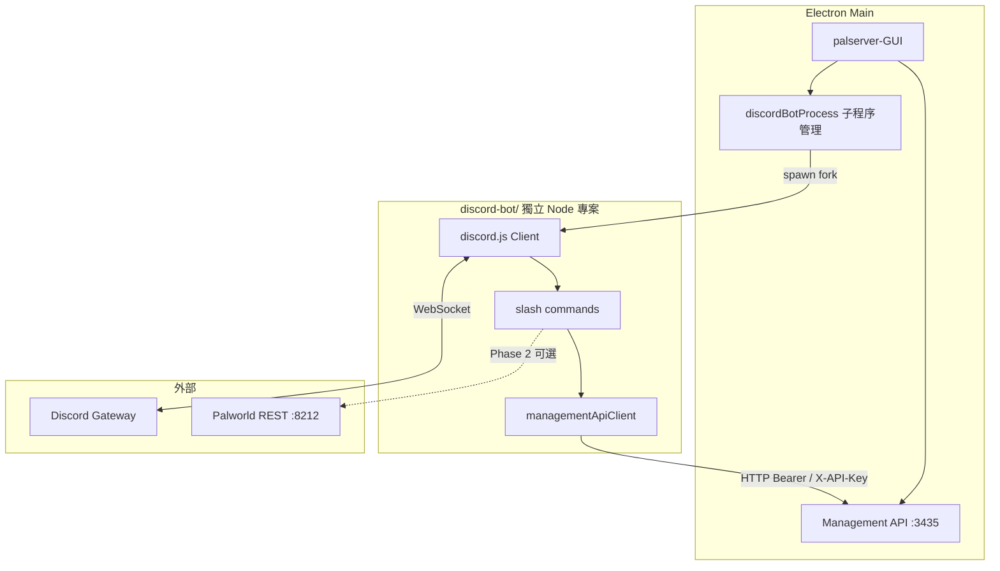

# 實作計畫：Discord Bot 整合（Node.js）

> **功能代號**：`P3-DISCORD-BOT` / `feature/discord-bot`  
> **狀態**：Phase 1–2 已交付（v1.5.0）  
> **目標版本**：v1.5.0（建議最小交付）  
> **基準版本**：v1.4.2（本機 Management API、每日排程啟停）  
> **規格依據**：[ROADMAP_P3_FEATURES.md](./ROADMAP_P3_FEATURES.md) 跨功能自動化延伸  
> **前置依賴**：本機 Management API 已交付（v1.4.2）  
> **最後更新**：2026-07-13

---

## 1. 摘要

在專案根目錄新增獨立資料夾 `discord-bot/`，以 **Node.js + discord.js** 實作 Discord bot。GUI（Electron main 程序）在啟動時**可選** spawn 此 bot 子程序；bot 透過 HTTP 呼叫本機 **Management API**（預設 `http://127.0.0.1:3435`）觸發伺服器狀態查詢、啟動、關閉、重啟。

**設計原則：**

- **獨立資料夾、可獨立部署**：進階使用者可在 VPS 上單獨執行同一份 bot，無需綁定 GUI 生命週期。
- **可選一鍵啟用**：一般家用服主可在設定頁開啟「啟動 GUI 時一併啟動 Discord bot」。
- **與 Electron 同生態**：採 Node.js，避免額外 Python runtime 依賴與打包問題。
- **職責分離**：GUI 管開服與生命週期；bot 管 Discord 互動、權限、指令格式。

**Phase 1 最小交付**：bot 可透過 Management API 查狀態與受控啟停；GUI 可選啟停 bot 子程序。  
**Phase 2 可選**：bot 直接呼叫 Palworld REST API（踢人、廣播、玩家列表等）。

---

## 2. 目標與範圍

### 2.1 要解決的問題

| 現況 | 痛點 |
|------|------|
| Management API 僅提供 HTTP 端點，無 Discord 介面 | 服主須自行寫腳本或手動打 API |
| 無內建 Discord 通知／指令 | 開服狀態、重啟需切回 GUI 或 RDP |
| 社群常見需求為 Discord 查人數、遠端重啟 | 與現有 API 能力匹配，但缺少現成整合 |

### 2.2 交付目標（Goals）

1. 新增 `discord-bot/` 目錄，含可獨立執行的 Node.js 專案（`package.json`、`src/`、設定範例、README）。
2. GUI 設定頁可配置：啟用 bot、Discord Token、預設 `serverId`、允許操作的 guild／角色。
3. GUI 啟動時，若啟用則 spawn bot；GUI 關閉時確實 terminate bot（避免殭屍程序）。
4. Bot 透過 Management API 支援 Phase 1 指令（見 §4.3）。
5. Bot 設定與 Management API 金鑰由 GUI 寫入共用設定檔，bot 啟動時讀取。
6. 保留**獨立部署**：`cd discord-bot && npm start` 可在無 GUI 環境運行（需 Management API 可達）。
7. 文件、E2E 清單條目、五語系 i18n 同步更新。

### 2.3 非目標（Non-Goals）

Phase 1 **不包含**：

- 在 Electron renderer 內直接嵌入 Discord 邏輯（bot 一律為獨立子程序）
- Python 或其他非 Node runtime
- Bot 24/7 與 GUI 生命週期脫鉤的內建「常駐模式」（進階使用者改獨立部署 bot）
- 完整社群營運功能（票務、經濟、身分組同步、審核流程）
- Management API 端點擴充（Phase 1 僅**消費**既有 API）
- Discord Webhook 僅通知（可列 Phase 1.5 或與 bot 並行，本計畫以 slash commands 為主）
- 遠端實例的 `start`／`restart`（Management API 已回 `501`，bot 須明確提示）

Phase 2 **可選、不阻塞 Phase 1**：

- 透過 Palworld REST API（`8212`）實作 `/players`、`/announce`、`/kick` 等
- Management API 代理層（由 GUI 統一轉發遊戲 REST，降低 bot 需持有 Admin 密碼的風險）

### 2.4 與現有能力邊界

| 能力 | Management API（v1.4.2） | Discord Bot Phase 1 | Discord Bot Phase 2 |
|------|---------------------------|---------------------|---------------------|
| 列出 GUI 管理的實例 | `GET /api/servers` | `/servers` | — |
| 查單一實例狀態 | `GET /api/servers/:id/status` | `/status` | — |
| 啟動本機實例 | `POST .../start` | `/start`（受權限保護） | — |
| 關閉實例 | `POST .../stop` | `/stop` | — |
| 重啟本機實例 | `POST .../restart` | `/restart` | — |
| 線上玩家列表 | — | — | `/players`（Palworld REST） |
| 全服廣播 | — | — | `/announce` |
| 踢人／封禁 | — | — | `/kick`／`/ban`（高風險，需嚴格權限） |
| 遠端實例啟動／重啟 | `501` | 回覆明確錯誤訊息 | — |

### 2.5 使用者流程（Target UX）

#### 流程 A：首次設定

```
設定 → Discord Bot
  → 開啟「啟用 Discord Bot」
  → 填寫 Discord Bot Token（或從 Discord Developer Portal 複製）
  → 填寫 Guild ID、允許操作的角色／使用者 ID
  → 選擇預設 serverId（下拉：本機 Management API 可見的實例列表）
  → 確認 Management API 已啟用（可連結至既有「本機 Management API」區塊）
  → 儲存 → GUI 寫入 discord-bot/config.json → spawn bot
```

#### 流程 B：日常使用（GUI 已開啟）

```
Discord 頻道輸入 /status
  → bot 呼叫 GET http://127.0.0.1:3435/api/servers/{id}/status
  → 回覆 embed：running、restReachable、isRemote 等

Discord 輸入 /restart（需 Admin 角色）
  → bot 呼叫 POST .../restart
  → 回覆成功或錯誤（含 501 遠端限制說明）
```

#### 流程 C：獨立部署（進階）

```
在 VPS 或常駐主機
  → git clone / 複製 discord-bot/
  → 設定 MANAGEMENT_API_URL 指向開服主機（需防火牆／API 金鑰）
  → npm install && npm start
  → GUI 可關閉，bot 與 Management API 仍各自運行
```

---

## 3. 架構設計

### 3.1 總覽



### 3.2 為何採 Node.js（非 Python）

| 考量 | Node.js | Python |
|------|---------|--------|
| 與 Electron 同生態 | 是，無額外 runtime | 需使用者安裝或 PyInstaller 打包 |
| 子程序啟動 | `child_process.fork` 同語言、易除錯 | 需找 `python` / `python3` 路徑 |
| 依賴管理 | 與 monorepo 或 `discord-bot/package.json` 一致 | 另需 `requirements.txt`、venv |
| discord 生態 | `discord.js` 成熟 | `discord.py` 亦成熟，但整合成本高 |
| 發布體積 | 可隨 electron-builder 打包 `discord-bot/` | PyInstaller 顯著增大安裝包 |

**結論**：獨立 `discord-bot/` 資料夾仍保留模組邊界，但 runtime 與 GUI 一致，降低 Windows 服主支援成本。

### 3.3 程序生命週期

| 事件 | 行為 |
|------|------|
| `app.ready` + 設定 `discordBot.enabled` | `fork('discord-bot/dist/index.js')` 或 dev 時 `tsx src/index.ts` |
| 設定儲存且 bot 相關欄位變更 | `stopDiscordBot()` → `startDiscordBot()` 熱重載 |
| `app.before-quit` / `window-all-closed` | `SIGTERM` bot → 逾時則 `kill` |
| bot 非零 exit | 記錄 log；可選指數退避重啟（預設關閉，避免 Token 錯誤無限重試） |
| Management API 未啟用但 bot 已啟用 | GUI 儲存時警告；bot 啟動後 `/status` 回連線失敗說明 |

建議新增 `src/main/services/discord-bot/discordBotProcess.ts`：

- `startDiscordBot(config)`
- `stopDiscordBot()`
- `isDiscordBotRunning()`
- `getDiscordBotLogs()`（可選，讀取 ring buffer 或 log 檔）

參考既有 `spawn` 模式：`src/main/services/serverExec/startLocalServer.ts`。

### 3.4 Management API 消費方式

Bot 端封裝 `managementApiClient.ts`：

```typescript
// discord-bot/src/api/managementApiClient.ts（概念）
const baseUrl = process.env.MANAGEMENT_API_URL ?? 'http://127.0.0.1:3435';
const apiKey = process.env.MANAGEMENT_API_KEY ?? '';

async function request(method: string, path: string, body?: unknown) {
  const headers: Record<string, string> = {};
  if (apiKey) headers.Authorization = `Bearer ${apiKey}`;
  const res = await fetch(`${baseUrl}${path}`, {
    method,
    headers: { ...headers, 'Content-Type': 'application/json' },
    body: body ? JSON.stringify(body) : undefined,
  });
  if (!res.ok) throw await res.json();
  return res.json();
}
```

對照既有端點（`src/main/server/management-api/routes.ts`）：

| 方法 | 路徑 | Bot 用途 |
|------|------|----------|
| GET | `/api/health` | 啟動自檢（可不帶金鑰） |
| GET | `/api/servers` | `/servers` 指令 |
| GET | `/api/servers/:serverId/status` | `/status` 指令 |
| POST | `/api/servers/:serverId/start` | `/start` |
| POST | `/api/servers/:serverId/stop` | `/stop`（body 可含 `waitMinutes`, `message`） |
| POST | `/api/servers/:serverId/restart` | `/restart` |
| GET | `/api/servers/:serverId/players` | `/players`（Phase 2，GUI 代理 Palworld REST） |
| POST | `/api/servers/:serverId/announce` | `/announce`（Phase 2，body: `{ message }`） |

認證：與 `middleware.ts` 一致，支援 `Authorization: Bearer` 或 `X-API-Key`。

---

## 4. 目錄與模組結構

### 4.1 建議目錄樹

```
discord-bot/
  package.json              # 獨立依賴：discord.js、typescript 等
  tsconfig.json
  config.example.json       # 提交至 git；實際 config.json gitignore
  README.md                 # 獨立部署與開發說明
  src/
    index.ts                # 進入點：載入設定、登入 Discord、註冊指令
    config.ts               # 讀取 config.json + 環境變數覆寫
    bot/
      client.ts             # discord.js Client 建立
      registerCommands.ts   # 向 Discord 註冊 slash commands
    api/
      managementApiClient.ts
      palworldRestClient.ts # Phase 2
    commands/
      status.ts
      servers.ts
      start.ts
      stop.ts
      restart.ts
    auth/
      assertAllowed.ts      # guild / role / user 檢查
    utils/
      formatStatusEmbed.ts
```

### 4.2 GUI 端新增／修改（規劃）

| 路徑 | 用途 |
|------|------|
| `src/types/DiscordBot.types.ts` | 設定型別 |
| `src/main/services/discord-bot/discordBotConfig.ts` | 讀寫 `discord-bot/config.json` |
| `src/main/services/discord-bot/discordBotProcess.ts` | spawn / kill 子程序 |
| `src/main/ipcs/discord-bot/getDiscordBotConfig.ts` | IPC 讀設定 |
| `src/main/ipcs/discord-bot/setDiscordBotConfig.ts` | IPC 寫設定 + 重載 bot |
| `src/renderer/components/AboutSection/Settings/DiscordBotSettings.tsx` | 設定 UI |
| `src/main/main.ts` | `app.ready` 啟動 bot；`before-quit` 停止 bot |

### 4.3 Phase 1 指令清單

| 指令 | 說明 | 權限 | API |
|------|------|------|-----|
| `/status [serverId]` | 顯示運行狀態、REST 是否可達 | 所有人（或僅 guild 成員） | `GET .../status` |
| `/servers` | 列出 GUI 內所有實例摘要 | 同上 | `GET /api/servers` |
| `/start [serverId]` | 啟動本機實例 | Admin 角色 | `POST .../start` |
| `/stop [serverId]` | 關閉（可選等待分鐘） | Admin 角色 | `POST .../stop` |
| `/restart [serverId]` | 重啟本機實例 | Admin 角色 | `POST .../restart` |

`serverId` 省略時使用設定中的 `defaultServerId`。

### 4.4 設定檔格式（`discord-bot/config.json`）

```json
{
  "enabled": false,
  "discord": {
    "token": "",
    "clientId": "",
    "guildId": "",
    "allowedRoleIds": [],
    "allowedUserIds": []
  },
  "managementApi": {
    "baseUrl": "http://127.0.0.1:3435",
    "apiKey": ""
  },
  "defaultServerId": "",
  "dangerousCommandsRequireAdmin": true
}
```

**安全規則：**

- `config.json` 加入 `.gitignore`；僅提交 `config.example.json`。
- GUI 寫入時，若 Management API 綁定非 `127.0.0.1`，自動同步 `apiKey`（讀取 `management-api.config.json`）。
- Discord Token 在 UI 以 password 欄位顯示；log 中不得明文輸出。

**環境變數覆寫（獨立部署用）：**

| 變數 | 說明 |
|------|------|
| `DISCORD_BOT_TOKEN` | 覆寫 `discord.token` |
| `MANAGEMENT_API_URL` | 覆寫 `managementApi.baseUrl` |
| `MANAGEMENT_API_KEY` | 覆寫 `managementApi.apiKey` |
| `DEFAULT_SERVER_ID` | 覆寫 `defaultServerId` |

---

## 5. 安全與權限

### 5.1 威脅模型

| 風險 | 緩解 |
|------|------|
| 任意 Discord 使用者觸發關服 | `allowedRoleIds` / `allowedUserIds`；危險指令僅 Admin |
| Token 外洩 | 不進 git；設定頁遮罩；獨立 log 檔權限 |
| Management API 暴露外網 | 預設 `127.0.0.1`；文件警告；非本機綁定強制 API Key |
| Bot 與 GUI 同機被入侵 | 最小權限；Phase 2 避免 bot 直接持 Admin 密碼（優先走 GUI proxy） |

### 5.2 權限檢查（bot 端）

```typescript
// 概念：危險指令前呼叫
function assertCanManage(interaction: ChatInputCommandInteraction, config: Config) {
  if (config.discord.allowedUserIds.includes(interaction.user.id)) return;
  const member = interaction.member as GuildMember;
  if (member.roles.cache.some((r) => config.discord.allowedRoleIds.includes(r.id))) return;
  throw new UserFacingError('你沒有權限執行此指令');
}
```

### 5.3 與 Management API 的關係

- Phase 1：bot **必須**在 Management API 啟用時才能執行生命週期指令。
- GUI 設定頁應連動提示：「啟用 Discord Bot 前請先啟用本機 Management API」。
- 若僅需 Discord 通知、不需啟停，可另列 Webhook 功能，不阻塞本計畫。

---

## 6. 實作階段與 PR 拆分

### Phase 1 — 最小可交付（建議 v1.5.0）

| Phase | 內容 | 建議 PR | 依賴 |
|-------|------|---------|------|
| **1** | 建立 `discord-bot/` 骨架、`managementApiClient`、config 載入 | PR-1 | — |
| **2** | 實作 `/status`、`/servers`；本地 `npm start` 可連 Management API | PR-2 | PR-1 |
| **3** | 實作 `/start`、`/stop`、`/restart` + 權限檢查 | PR-3 | PR-2 |
| **4** | GUI：`DiscordBot.types`、config 讀寫、`discordBotProcess` spawn/kill | PR-4 | PR-1 |
| **5** | GUI：`DiscordBotSettings.tsx`、i18n 五語系、與 Management API 設定連動 | PR-5 | PR-4 |
| **6** | `main.ts` 生命週期整合、log、錯誤 toast | PR-6 | PR-4, PR-5 |
| **7** | 單元測試（api client mock）、文件、`WINDOWS_E2E_TEST_CHECKLIST` 條目 | PR-7 | PR-1–6 |

### Phase 2 — 遊戲內操作（可選，v1.5.x 或 v1.6.0）

| Phase | 內容 | 備註 |
|-------|------|------|
| **8** | `palworldRestClient`：`/info`、`/players`、`/announce` | bot 需 Admin 密碼或 GUI proxy |
| **9** | 評估 Management API 新增 `/api/servers/:id/players` proxy | 降低 bot 持有遊戲密碼 |
| **10** | `/kick`、`/ban`（嚴格權限 + 二次確認） | 高風險，可延後 |

### Phase 3 — 體驗增強（可選）

- Discord Webhook：開服／關服／排程重啟通知（GUI 發送，無需 bot 常駐）
- Bot 狀態指示：設定頁顯示 running / stopped / last error
- 多 `serverId` 別名（顯示名稱 → serverId 對照）

---

## 7. 驗收條件（Acceptance Criteria）

### Phase 1

- [ ] `discord-bot/` 可透過 `npm install && npm start` 獨立啟動（需有效 `config.json` 與 Management API）
- [ ] GUI 設定頁可啟用／停用 bot，儲存後寫入 `discord-bot/config.json`
- [ ] GUI 啟動且 bot 啟用時，自動 spawn bot；關閉 GUI 後 bot 程序結束
- [ ] `/status`、`/servers` 回傳正確資料（本機與遠端實例）
- [ ] `/start`、`/stop`、`/restart` 僅允許設定之角色／使用者
- [ ] 遠端實例 `/start`、`/restart` 回傳友善錯誤（對應 `501`）
- [ ] Management API 未啟用時，設定頁顯示警告
- [ ] `config.json` 與 Token 未提交至 git
- [ ] 本機實例既有 GUI 行為無 regression
- [ ] README（中／英）、`docs/README.md` 索引、E2E 清單更新
- [ ] 五語系翻譯鍵補齊

### Phase 2（若實作）

- [x] `/players`、`/announce` 在本機運行中的伺服器上可用
- [x] 文件說明 Admin 密碼存放方式與風險（透過 Management API 代理，bot 不持有 Admin 密碼）

---

## 8. 測試策略

| 層級 | 範圍 | 方式 |
|------|------|------|
| 單元 | `managementApiClient`、`assertAllowed`、embed 格式化 | Jest + mock `fetch` |
| 整合 | Management API 真實 HTTP（沿用 `managementApi.test.js` 模式） | 現有 jest node env |
| Bot 指令 | slash handler 邏輯 | mock `interaction` |
| E2E | GUI 啟停 bot、Discord 實際指令 | 手動；列入 `WINDOWS_E2E_TEST_CHECKLIST.md` §2D |
| 回歸 | 本機開服、Management API、排程 | 既有 CI `npm test` |

**E2E 建議條目（§2D 草案）：**

| # | 步驟 | 預期 |
|---|------|------|
| 2D.1 | 啟用 Management API + Discord Bot，填 Token，儲存 | 設定保留；bot 程序存在 |
| 2D.2 | Discord 執行 `/status` | 回傳 running／offline 正確 |
| 2D.3 | Admin 執行 `/restart` | 本機實例重啟；一般使用者被拒絕 |
| 2D.4 | 關閉 GUI | bot 程序結束 |
| 2D.5 | 遠端實例 `/start` | 回覆不支援說明 |

---

## 9. 風險與依賴

| 風險 | 緩解 |
|------|------|
| GUI 關閉 bot 下線 | 文件說明；支援獨立部署 |
| Discord Token 無效導致 crash loop | 預設不自動重啟；設定頁顯示 stderr 摘要 |
| `discord.js` 大版本升級 | `discord-bot/package.json` 鎖版本；Dependabot 獨立於 GUI |
| electron-builder 未打包 `discord-bot/` | `package.json` `extraResources` 或 `files` 明確列入 |
| 開發模式路徑與 production 路徑不一致 | `discordBotProcess` 依 `app.isPackaged` 解析 `discord-bot` 路徑 |
| 使用者期望 bot 24/7 | UX 文案與 README 區分「隨 GUI 啟動」與「獨立常駐」 |

---

## 10. 文件與發布

### 10.1 需更新文件

| 文件 | 變更 |
|------|------|
| `docs/README.md` | 索引新增本計畫 |
| `README.md` / `README_EN.md` | 功能列表新增 Discord Bot（可選） |
| `CHANGELOG.md` | v1.5.0 Added 區塊 |
| `docs/WINDOWS_E2E_TEST_CHECKLIST.md` | 新增 §2D |
| `discord-bot/README.md` | 獨立部署、Token 申請、指令列表 |

### 10.2 發布注意

- `electron-builder` 將 `discord-bot/dist` 或執行所需檔案打入 `resources/discord-bot/`。
- 首次啟用 bot 時若無 `node_modules`，可於 `postinstall` 預編譯 bot 或隨安裝包附帶已 bundle 的 `index.js`（webpack esbuild 單檔輸出可簡化 spawn）。

---

## 11. 給 AI Agent 的實作檢查清單

開始 PR 前請確認：

1. 已閱讀本文件 **Goals / Non-Goals / Phase 1 驗收條件**
2. `discord-bot/` 保持可獨立 `npm start`，不依賴 Electron renderer
3. spawn 邏輯放 **main 程序**，不在 renderer 呼叫 `child_process`
4. Token、API Key 不得寫入 log 明文或 commit
5. 危險指令必須有 role／user 檢查
6. 新增 UI 字串更新 `locales/{zh_tw,zh_cn,en,jp,fr}/translation.js`
7. Management API 行為不可 regression
8. 遠端 `501` 須轉成使用者可讀 Discord 訊息

---

## 12. 修訂紀錄

| 日期 | 版本 | 說明 |
|------|------|------|
| 2026-07-13 | 1.0 | 初版：Node.js 獨立 `discord-bot/`、GUI spawn、Management API 整合規劃 |
