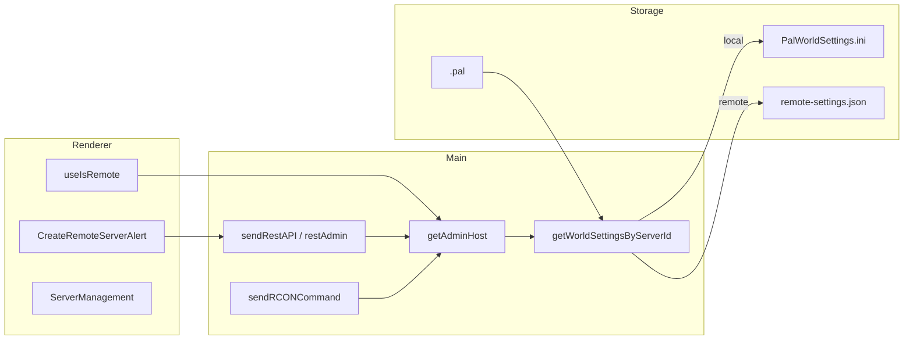
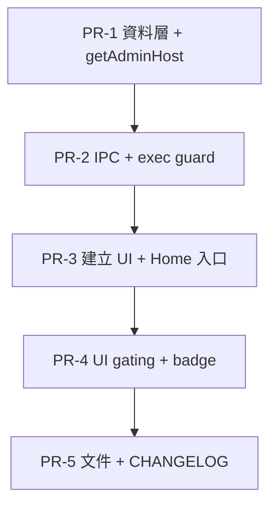

# 實作計畫：功能 1 Tier 1 — 遠端伺服器 REST 管理

> **功能代號**：`P3-REMOTE` / `feature/remote-server-instance`  
> **狀態**：規劃中（未實作）  
> **目標版本**：v1.3.3（Tier 1 完整交付）  
> **基準版本**：v1.2.1  
> **規格依據**：[ROADMAP_P3_FEATURES.md](./ROADMAP_P3_FEATURES.md) §1.7–1.10  
> **最後更新**：2026-07-13

---

## 1. 摘要

讓使用者在本機 GUI 建立「遠端連線」類型伺服器實例，透過 REST API（及可選 RCON）管理已在 VPS / 遠端主機上運行的 Palworld 1.0 專服，無需複製本機 `server/` 目錄或 RDP 連線。

**Tier 1 最小交付**：建立遠端連線 → 連線測試 → 列表顯示 → REST 管理（玩家、踢封、廣播、存檔、關機）。

---

## 2. 目標與範圍

### 2.1 要解決的問題

| 現況 | 痛點 |
|------|------|
| 建立實例複製完整 `server/` 模板 | 遠端已架好的服無法納入 GUI |
| REST/RCON 硬編碼 `127.0.0.1` | 無法對外網主機發請求 |
| 啟動/停止依賴本機 process spawn | 遠端服只能手動或 RDP 操作 |

### 2.2 Tier 1 交付目標（Goals）

1. 新增「遠端連線」實例類型，僅儲存連線 metadata。
2. 建立前執行 REST 連線測試（`GET /v1/api/info`）。
3. 對遠端實例支援與 v1.2.0 本機 REST 對齊的管理操作。
4. 遠端與本機實例在首頁列表共存，UI 可區分類型。
5. 本機實例行為與 v1.2.1 **完全一致**（零回歸）。

### 2.3 非目標（Non-Goals）

Tier 1 **不包含**：

- SSH / SFTP / RDP 連線
- 遠端 SteamCMD 一鍵更新遊戲引擎
- 遠端 Mod 管理、日誌讀取、備份瀏覽
- 遠端世界設定 INI 編輯
- TLS / HTTPS 加密 REST
- 遠端 spawn `PalServer.exe`
- 線上地圖 proxy 改打遠端 host（Tier 1 禁用）

### 2.4 使用者流程（Target UX）

```
首頁 → 建立遠端連接
  → 填寫：顯示名稱、主機 IP/域名、REST 埠（預設 8212）、Admin 密碼
  → [可選] RCON 埠（預設 25575）
  → [測試連線] GET /v1/api/info
  → 成功 → 寫入輕量實例 → 出現在伺服器列表（遠端 badge）
  → 進入管理：玩家列表、踢/封、廣播、存檔、關機、metrics、版本資訊
```

---

## 3. 架構設計

### 3.1 核心 refactor：連線目標解析

將各處硬編碼 `127.0.0.1` 抽成單一服務 `getAdminHost(serverId)`：

```
isRemote === false（或未設定）→ host = '127.0.0.1'，埠/密碼從 INI 讀取
isRemote === true              → host = remoteHost，埠/密碼從 remote-settings.json 讀取
```



### 3.2 遠端實例儲存結構

```
{USER_SERVER_INSTANCES_PATH}/{serverId}/
  .pal                    # ServerInstanceSetting（isRemote: true）
  remote-settings.json    # 連線與顯示用設定（無 server/ 子目錄）
```

### 3.3 資料模型

#### `ServerInstanceSetting` 擴充

```typescript
// src/types/ServerInstanceSetting.types.ts
export type ServerInstanceSetting = {
  // ...既有欄位
  readonly isRemote?: boolean;        // 預設 false，向後相容
  readonly remoteHost?: string;
  readonly remoteRestPort?: number;   // 預設 8212
  readonly remoteRconPort?: number;   // 預設 25575
};
```

#### `remote-settings.json` schema

```typescript
type RemoteSettings = {
  ServerName: string;
  PublicIP: string;         // IP 或域名
  RESTAPIPort: number;      // 預設 8212
  RCONPort: number;         // 預設 25575
  AdminPassword: string;
  RESTAPIEnabled: true;
  RCONEnabled: boolean;
};
```

#### 遠端 `.pal` 建議預設值

| 欄位 | 值 | 理由 |
|------|-----|------|
| `isRemote` | `true` | 標記類型 |
| `modManagementEnabled` | `false` | 無本機 server/ |
| `LogEnabled` | `false` | 無本機日誌 |
| `OnlineMapEnabled` | `false` | Tier 1 禁用 |
| `performanceMonitorEnabled` | `false` | 無本機 process |
| `ue4ssEnabled` / `palguardEnabled` | `false` | 無本機 DLL |
| `instancePath` | `{instances}/{serverId}` | 相容既有路徑邏輯 |

### 3.4 必須參數化的 localhost 硬編碼點

| 檔案 | 行號（約） | 用途 | Tier 1 處理 |
|------|------------|------|-------------|
| `src/main/ipcs/server/rest/sendRestAPI.ts` | 21 | REST IPC | 改用 `getAdminHost` |
| `src/main/services/admin/restAdmin.ts` | 27 | REST 服務層 | `RestAdminConfig` 加 `host` |
| `src/main/ipcs/server/rcon/sendRCONCommand.ts` | 15 | RCON IPC | 改用 `getAdminHost` |
| `src/main/ipcs/server/exec/execShutdownServer.tsx` | 11 | 關機 RCON | guard 遠端 |
| `src/main/ipcs/server/exec/execStartServer.tsx` | 267, 316 | 定時重啟 RCON | guard 遠端 |
| `src/main/server/server-online-map/server.ts` | 18, 42 | 地圖 proxy | 遠端禁用 |

**關鍵依賴**：`getWorldSettingsByServerId.ts` 目前只讀本機 INI，遠端實例會回傳 `{}`，必須在 Phase 1 完成分支。

### 3.5 新增 IPC Channel

| Channel | 用途 |
|---------|------|
| `testRemoteConnection` | 建立前驗證 REST 可達 |
| `createRemoteServerInstance` | 建立 metadata-only 實例 |

註冊於 `src/main/ipcs/channels.ts` 與 `src/main/ipcs/index.ts`。

---

## 4. 實作階段

### Phase 1：資料層與連線解析（核心）

**目標**：遠端實例建立後，REST/RCON 能打對 host。  
**建議 PR**：`PR-1`

| # | 任務 | 檔案 |
|---|------|------|
| 1.1 | 擴充 `ServerInstanceSetting` 型別 | `src/types/ServerInstanceSetting.types.ts` |
| 1.2 | remote settings 讀寫服務 | `src/main/services/remote/readRemoteSettings.ts`（新） |
| | | `src/main/services/remote/writeRemoteSettings.ts`（新） |
| 1.3 | 世界設定讀取分支 | `src/main/services/worldSettings/getWorldSettingsByServerId.ts` |
| 1.4 | 連線解析服務 | `src/main/services/admin/getAdminHost.ts`（新） |
| 1.5 | REST 服務層加 host | `src/main/services/admin/restAdmin.ts` |
| 1.6 | REST IPC 參數化 | `src/main/ipcs/server/rest/sendRestAPI.ts` |
| 1.7 | RCON IPC 參數化 | `src/main/ipcs/server/rcon/sendRCONCommand.ts` |
| 1.8 | 單元測試 | `src/__tests__/getAdminHost.test.ts`（新） |

**驗證**：手動放置測試 `.pal` + `remote-settings.json`，透過既有 `sendRestAPI` 打遠端 `/info`。

---

### Phase 2：IPC 與建立流程

**目標**：程式化建立遠端實例、連線測試、防止本機 spawn。  
**建議 PR**：`PR-2`（依賴 PR-1）

| # | 任務 | 說明 |
|---|------|------|
| 2.1 | 新增 channel 常數 | `channels.ts` |
| 2.2 | `testRemoteConnection` IPC | 輸入 host/port/password → `{ ok, error?, info? }` |
| 2.3 | `createRemoteServerInstance` IPC | 寫 `.pal` + `remote-settings.json`，不 `fs.cp` 模板 |
| 2.4 | 註冊 handler | `src/main/ipcs/index.ts` |
| 2.5 | exec guard | `execStartServer.tsx`、`execShutdownServer.tsx` 對 `isRemote` early return |
| 2.6 | duplicate guard | `duplicateServerInstance.ts` 拒絕遠端 |
| 2.7 | 整合測試 | mock axios：200 / ECONNREFUSED / 401 |

**`createRemoteServerInstance` 輸入：**

```typescript
{
  ServerName: string;
  PublicIP: string;
  RESTAPIPort?: number;   // default 8212
  RCONPort?: number;      // default 25575
  AdminPassword: string;
}
```

---

### Phase 3：建立 UI 與首頁入口

**目標**：使用者可從 GUI 完成端到端建立。  
**建議 PR**：`PR-3`（依賴 PR-2）

| # | 任務 | 檔案 |
|---|------|------|
| 3.1 | 重寫建立對話框 | `CreateRemoteServerAlert.tsx` |
| 3.2 | 對齊本機建立 UX | 參考 `CreateServerAlert.tsx`：`SecureEye`、required 驗證、disabled Create |
| 3.3 | 欄位設計 | `ServerName`、`PublicIP`、`RESTAPIPort`（8212）、`RCONPort`（可選）、`AdminPassword` |
| 3.4 | 測試連線按鈕 | 呼叫 `testRemoteConnection` |
| 3.5 | 建立按鈕 | 測試通過後啟用；呼叫 `createRemoteServerInstance` |
| 3.6 | 啟用首頁入口 | `Home.tsx` 取消 `CreateRemoteServer` 註解 |
| 3.7 | 遠端 badge | `ServerInstance.tsx` 顯示「遠端」標記 |
| 3.8 | i18n | 五語系錯誤訊息與欄位說明 |

**注意**：現有 `CreateRemoteServerAlert` 的 `publicPort` 語意是遊戲埠（8211），遠端表單須改用 `RESTAPIPort`（8212）。

**連線測試錯誤對照：**

| 情境 | 使用者訊息 |
|------|------------|
| 埠不通 / timeout | 無法連線至 {host}:{port}，請檢查防火牆與埠轉發 |
| 401 / 403 | Admin 密碼錯誤 |
| REST 未啟用 | 伺服器未啟用 REST API |
| DNS 失敗 | 無法解析主機名稱 |

---

### Phase 4：UI 功能開關（`isRemote` gating）

**目標**：遠端實例不暴露本機專用功能，避免誤操作或崩潰。  
**建議 PR**：`PR-4`（依賴 PR-3）

新增 hook：`src/renderer/hooks/server/useIsRemote.ts`

#### 4.1 右側面板

| 元件 | 遠端行為 |
|------|----------|
| `BootServerButton` | 隱藏啟動/停止 |
| `WorldSettings` 按鈕 | 隱藏 |
| `ModManagement` 按鈕 | 隱藏 |
| `ServerPreview` | 顯示遠端 `host:port` |
| `ServerRunningBadge` | 見 Phase 5 |

#### 4.2 伺服器管理頁

| 功能 | 遠端 |
|------|------|
| 玩家列表、踢封、廣播、存檔、關機 | **保留** |
| 伺服器日誌 | 隱藏 / disabled |
| 線上地圖 | 隱藏 |
| 效能監控 | 隱藏 |
| 伺服器設定（Steam 更新、UE4SS 等） | 隱藏 |

#### 4.3 首頁實例操作

| 操作 | 遠端 |
|------|------|
| 開啟資料夾、複製、資料夾大小 | 隱藏 |
| 編輯伺服器 | 改編輯 `remote-settings.json` 欄位 |
| 刪除連線 | 保留 |

#### 4.4 其他 guard

- `EngineNeedInstall`：`updateServerInstance` 跳過 `isRemote`
- `WorldSettings.tsx`：路由 guard
- disabled 按鈕 + tooltip：「遠端連線不支援此功能」

**需修改的 UI 檔案清單：**

- `RightSection.tsx`、`BootServerButton.tsx`、`ServerRunningBadge.tsx`、`ServerPreview.tsx`
- `ServerManagement.tsx`、`ServerSettings.tsx`、`ServerLog.tsx`、`Boardcastbar.tsx`
- `OnlineMap.tsx`、`PerformanceMonitor.tsx`
- `ServerInstance.tsx`、`EditServerAlert.tsx`、`DuplicateServerAlert.tsx`
- `WorldSettings.tsx`、`App.tsx`

---

### Phase 5：狀態顯示與邊角處理

可與 Phase 4 合併為同一 PR。

| # | 任務 | 說明 |
|---|------|------|
| 5.1 | `ServerRunningBadge` | 遠端輪詢 REST `/info`（如 30s）判斷 Online |
| 5.2 | `OnlineMap` | 遠端不渲染 iframe |
| 5.3 | `getServerBanList` | 遠端讀不到本機 `banlist.txt`；Tier 1 顯示限制說明 |
| 5.4 | `preload.ts` 版本 API | `SERVER_*_VERSION` 對遠端 skip |
| 5.5 | `sendRCONCommand` 錯誤回傳 | 改善吞錯誤行為（可選小改） |

---

### Phase 6：文件與發布

**建議 PR**：`PR-5`（依賴 PR-4）

| 任務 | 檔案 |
|------|------|
| README 遠端管理章節 | `README.md`、`README_EN.md` |
| 埠與安全說明 | REST 8212、HTTP Basic 明文風險、RCON 25575 可選 |
| E2E 清單 | `docs/WINDOWS_E2E_TEST_CHECKLIST.md` |
| CHANGELOG | `CHANGELOG.md` v1.3.0 區塊 |
| i18n 收尾 | `locales/{zh_tw,zh_cn,en,jp,fr}/translation.js` |

---

## 5. PR 拆分與依賴



| PR | 可獨立合併 | 使用者可見變化 |
|----|------------|----------------|
| PR-1 | 是（本機回歸必跑） | 無 |
| PR-2 | 否 | 無（僅 API） |
| PR-3 | 否 | **可 demo**：建立遠端連線 |
| PR-4 | 否 | 完整 UX |
| PR-5 | 否 | 文件 |

**第一個可 demo 里程碑**：PR-3 合併後。  
**可發布里程碑**：PR-5 合併且 E2E 全過。

---

## 6. 建議新增檔案

| 檔案 | 用途 |
|------|------|
| `src/main/services/admin/getAdminHost.ts` | 解析 host/port/password |
| `src/main/services/remote/readRemoteSettings.ts` | 讀 `remote-settings.json` |
| `src/main/services/remote/writeRemoteSettings.ts` | 寫 `remote-settings.json` |
| `src/main/ipcs/server/instance/createRemoteServerInstance.ts` | 建立遠端實例 |
| `src/main/ipcs/server/instance/testRemoteConnection.ts` | 連線測試 |
| `src/renderer/hooks/server/useIsRemote.ts` | UI gating helper |
| `src/__tests__/getAdminHost.test.ts` | 單元測試 |

---

## 7. 測試計畫

### 7.1 單元測試

| 對象 | 案例 |
|------|------|
| `getAdminHost` | 本機 → `127.0.0.1`；遠端 → `remoteHost`；缺欄位 fallback |
| remote settings I/O | round-trip、檔案不存在 |
| `testRemoteConnection` | mock axios：200 / ECONNREFUSED / 401 |
| `createRemoteServerInstance` | 不建立 `server/`；`.pal` 含 `isRemote: true` |

### 7.2 本機回歸（每 PR 必跑）

- [ ] 建立本機伺服器 → 啟動 → 踢人 → 廣播 → 關機
- [ ] REST 仍打 `127.0.0.1`
- [ ] 世界設定讀寫正常
- [ ] 自動重啟 / crash restart 不受影響

### 7.3 遠端手動 E2E

| # | 步驟 | 預期 |
|---|------|------|
| 1 | 建立遠端連線（正確 IP/埠/密碼） | 測試連線成功 |
| 2 | 建立實例 | 列表出現，有遠端 badge |
| 3 | 管理 → 玩家列表 | 顯示線上玩家 |
| 4 | 踢人 / 封禁 / 廣播 | 成功 |
| 5 | 存檔 / 關機 | 成功 |
| 6 | 啟動按鈕 | 不可見或 disabled |
| 7 | 世界設定 / Mod / 日誌 | 不可進入 |
| 8 | 錯誤密碼 | 明確錯誤訊息 |
| 9 | 埠不通 | 明確錯誤訊息 |
| 10 | 刪除遠端連線 | metadata 移除；本機實例不受影響 |

---

## 8. 驗收條件

對照 [ROADMAP_P3_FEATURES.md](./ROADMAP_P3_FEATURES.md) §1.9：

- [ ] 首頁可開啟「建立遠端連接」，填寫必要欄位後可建立實例
- [ ] 建立前連線測試失敗時有明確錯誤（埠不通、密碼錯、REST 未啟用）
- [ ] 遠端實例出現在列表，視覺上可與本機區分
- [ ] 對遠端實例可：列出玩家、踢人、封禁、廣播、存檔、關機
- [ ] 對遠端實例不可：本機 spawn 啟動、Steam 更新、Mod 管理（隱藏或 disabled + tooltip）
- [ ] 本機實例行為與 v1.2.1 完全一致
- [x] README / FAQ 新增遠端管理章節
- [x] 五語系翻譯鍵補齊

---

## 9. 風險與緩解

| 風險 | 影響 | 緩解 |
|------|------|------|
| 多處 `127.0.0.1` 漏改 | 遠端功能仍打本機 | 集中 `getAdminHost()`；grep 審查 |
| `getWorldSettingsByServerId` 回傳 `{}` | REST 無埠/密碼 | Phase 1 優先 |
| 遠端 REST 只 bind localhost | 使用者以為 GUI 壞了 | 連線測試錯誤 + 文件 |
| `ServerRunningBadge` 只看 process | 遠端永遠 Offline | Phase 5 REST 輪詢 |
| RCON 對外開放 | 安全風險 | 標為進階可選；文件警告 |
| 使用者期望遠端改設定 | 期望落差 | Non-Goals + tooltip |

---

## 10. 環境與安全前提（須告知使用者）

1. 遠端伺服器需 `RESTAPIEnabled=True`，且 `8212/TCP` 從 GUI 所在機器可連線。
2. REST 使用 HTTP 明文 + Basic Auth；不可在不可信網路暴露 Admin 密碼。
3. 對外開 RCON（25575）有安全風險；Tier 1 標為進階可選。
4. 防火牆 / NAT / 埠轉發需使用者自行設定。

---

## 11. 跨功能依賴

| 功能 | 關係 |
|------|------|
| 功能 2 Mod 檢查 | 完成後 `checkCompatibility` 須跳過 `isRemote` |
| 功能 5 設定產生器 | Tier 1 遠端不提供 INI 編輯 |
| KNOWN_ISSUES #1 SAV | 與遠端無關，不阻塞 |

---

## 12. AI Agent 實作檢查清單

開始 PR 前：

1. [ ] 已閱讀本計畫與 ROADMAP §1 的 Goals / Non-Goals / Acceptance Criteria
2. [ ] 本機實例 `isRemote` 為 false/undefined，REST 仍用 `127.0.0.1`
3. [ ] 新增 UI 字串更新五語系 `translation.js`
4. [ ] 連線邏輯加單元測試
5. [ ] 完成後更新 `CHANGELOG.md`
6. [ ] 所有假設本機 `server/` 路徑的程式已審查 `isRemote` 分支

---

## 修訂紀錄

| 日期 | 版本 | 說明 |
|------|------|------|
| 2026-07-13 | 1.1 | Phase 6 完成：文件、E2E、v1.3.3 發布 |
| 2026-07-13 | 1.0 | 初版：Tier 1 實作計畫（6 Phase、5 PR） |
