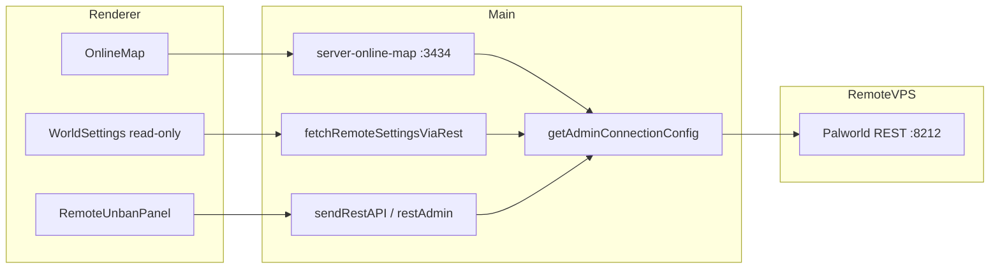
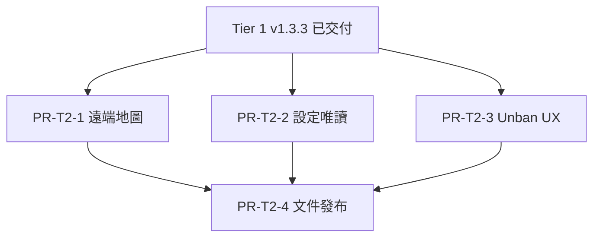

# 實作計畫：功能 1 Tier 2 — 遠端地圖與 REST 設定讀取

> **功能代號**：`P3-REMOTE` / `feature/remote-server-tier2`  
> **狀態**：規劃中（未實作）  
> **目標版本**：v1.4.0（Tier 2 最小交付）  
> **基準版本**：v1.3.3（Tier 1 已完整交付）  
> **規格依據**：[ROADMAP_P3_FEATURES.md](./ROADMAP_P3_FEATURES.md) §1.7 Tier 2  
> **前置計畫**：[PLAN_P3_REMOTE_TIER1.md](./PLAN_P3_REMOTE_TIER1.md)  
> **最後更新**：2026-07-13

---

## 1. 摘要

Tier 1 已透過 REST API 完成遠端專服的日常維運（玩家、踢封、廣播、存檔、關機）。Tier 2 在**不引入 SSH/SFTP** 的前提下，補齊兩項高需求能力：

1. **遠端線上地圖**：讓遠端實例也能在 GUI 內查看玩家即時位置（proxy 已具備遠端 host 解析，僅 UI 被 Tier 1 刻意關閉）。
2. **遠端世界設定唯讀檢視**：透過官方 `GET /v1/api/settings` 拉取遠端伺服器當前設定，在既有世界設定 UI 以唯讀模式呈現。

**Tier 2 最小交付**：遠端線上地圖可用 → 遠端設定唯讀頁面 → 封禁 UX 小幅強化（手動 unban）→ 文件與 E2E。

**明確留給 Tier 3**：SSH/SFTP 檔案存取（`banlist.txt`、INI 寫入、日誌、備份、Mod）。

---

## 2. 目標與範圍

### 2.1 要解決的問題

| Tier 1 現況 | 痛點 |
|-------------|------|
| `OnlineMap.tsx` 對 `isRemote` 直接 `return null` | 遠端服無法在 GUI 看地圖，須自行開瀏覽器打 REST |
| `ServerManagement.tsx` 隱藏地圖分頁 | 使用者不知道遠端其實可支援地圖 |
| `RemoteUnsupportedGuard` 阻擋世界設定頁 | 無法檢視遠端倍率、人數上限等參數 |
| `getWorldSettingsByServerId` 遠端只讀 `remote-settings.json` | 僅含連線欄位，不含遊戲世界參數 |
| `getServerBanList` 遠端回傳 `remoteLimited: true` | 無法瀏覽歷史封禁；僅能 REST 封禁線上玩家 |

### 2.2 Tier 2 交付目標（Goals）

1. 遠端實例可啟用並使用**線上地圖**（與本機相同 iframe + localhost proxy 架構）。
2. 遠端實例可進入**世界設定唯讀頁**，資料來源為 `GET /v1/api/settings`。
3. 遠端玩家頁提供**手動解除封禁**（`POST /v1/api/unban`），彌補無法列舉 `banlist.txt` 的部分缺口。
4. 本機實例行為與 v1.3.3 **完全一致**（零回歸）。
5. 文件、E2E、五語系 i18n 同步更新。

### 2.3 非目標（Non-Goals）

Tier 2 **不包含**（列 Tier 3 或未來版本）：

- SSH / SFTP / SCP 連線與金鑰管理
- 遠端 `PalWorldSettings.ini` **寫入**或熱更新（官方 REST 無設定寫入端點）
- 遠端 `banlist.txt` **完整列舉**（官方 REST 無 ban 列表 GET）
- 遠端伺服器日誌 tail、備份瀏覽、Mod 管理
- 遠端 SteamCMD 更新、程序 spawn
- TLS / HTTPS 加密 REST
- 線上地圖改為直連遠端靜態資源（維持本機 proxy 架構以降低 CORS／混合內容問題）

### 2.4 與 Tier 3 的邊界

| 能力 | Tier 2 | Tier 3 |
|------|--------|--------|
| 線上地圖 | REST proxy 讀玩家位置 | — |
| 世界設定檢視 | `GET /settings` 唯讀 | SFTP 讀寫 INI + 重啟提示 |
| 世界設定修改 | 不支援（文件說明需遠端重啟） | SFTP 上傳 INI |
| 封禁線上玩家 | 已支援（Tier 1） | — |
| 封禁名單瀏覽 | 不支援完整列表 | SFTP 讀 `banlist.txt` |
| 手動 unban（已知 Steam ID） | **新增** | — |
| 伺服器日誌 | 不支援 | SFTP tail 或 agent |

### 2.5 使用者流程（Target UX）

#### 流程 A：遠端線上地圖

```
選中遠端實例 → 伺服器管理 → 「線上地圖」分頁
  → iframe 載入 http://127.0.0.1:3434/?id={serverId}
  → proxy 以 getAdminConnectionConfig 打遠端 /players、/info
  → 地圖上顯示遠端線上玩家位置
```

#### 流程 B：遠端世界設定唯讀

```
選中遠端實例 → 右側「世界設定」（或伺服器管理內入口）
  → 頂部 Callout：「遠端設定為唯讀；修改請於遠端主機編輯 INI 並重啟」
  → GET /v1/api/settings → 解析並填入既有 WorldSettings GUI（全部 disabled）
  → [重新整理] 按鈕重新拉取 REST
  → [匯出 JSON]（若功能 5 Phase A 已交付則共用元件）
```

#### 流程 C：遠端手動解除封禁

```
選中遠端實例 → 伺服器管理 → 玩家
  → 封禁名單區塊：說明無法自動同步 banlist.txt
  → 輸入 Steam ID / UserId → [解除封禁]
  → POST /v1/api/unban → 成功／失敗 toast
```

---

## 3. 架構設計

### 3.1 現況與 Tier 2 變更重點

Tier 1 已完成 `getAdminConnectionConfig(serverId)` 集中解析；**線上地圖 proxy 後端已支援遠端**：

```12:30:src/main/server/server-online-map/server.ts
app.get('/:serverId/players', async (req, res) => {
  const serverId = req.params.serverId;
  const { host, restPort, adminPassword } =
    await getAdminConnectionConfig(serverId);
  // ... axios → http://${host}:${restPort}/v1/api/players
});
```

Tier 2 主要工作在前端 **解除 gating** 與新增 **REST settings 讀取層**，而非重寫連線架構。



### 3.2 官方 REST 端點（Tier 2 依賴）

| 方法 | 路徑 | Tier 2 用途 | 備註 |
|------|------|-------------|------|
| GET | `/v1/api/players` | 線上地圖 | Tier 1 已用 |
| GET | `/v1/api/info` | 地圖 metadata | Tier 1 已用 |
| GET | `/v1/api/settings` | 世界設定唯讀 | **新增整合** |
| POST | `/v1/api/unban` | 手動解封 | Tier 1 已有 `restUnbanPlayer`，UI 未暴露 |

> **重要**：社群與託管商文件一致指出 `GET /settings` 為**唯讀**；設定變更仍需編輯 INI 並重啟伺服器（且 `WorldOption.sav` 可能覆寫 INI，見 KNOWN_ISSUES #1）。

### 3.3 設定資料流

```
遠端 isRemote === true
  ├─ 連線參數：remote-settings.json（既有，不變）
  └─ 遊戲世界參數：
        Tier 2 → GET /v1/api/settings（執行時拉取，可快取 60s）
        Tier 3 → SFTP 讀 PalWorldSettings.ini（規劃中）

本機 isRemote === false
  └─ 維持讀取本機 PalWorldSettings.ini（不變）
```

建議新增 `src/main/services/remote/fetchRemoteWorldSettingsViaRest.ts`：

- 輸入：`serverId`
- 輸出：與 `readWorldSettingsini` 相同形狀的 `Record<string, unknown>`（需撰寫 response → INI 鍵名對照／正規化）
- 錯誤：REST 失敗時回傳 `{}` 並附 `errorCode` 供 UI 顯示

**不修改** `getWorldSettingsByServerId` 的遠端分支直接打 REST（避免每次 IPC 都打外網）；改由：

- 新 IPC `getRemoteWorldSettings` 專責 REST 拉取；或
- renderer hook `useRemoteWorldSettings` 透過 `sendRestAPI(serverId, '/settings')` 拉取

建議採 **renderer → sendRestAPI** 路徑，與既有 metrics／players 一致，減少 main 層 IPC 膨脹。

### 3.4 線上地圖啟用策略

| 方案 | 說明 | 建議 |
|------|------|------|
| A. 遠端預設啟用 | `buildRemoteServerInstanceSetting` 設 `OnlineMapEnabled: true` | **採用**（新建立遠端連線即可用地圖） |
| B. 僅手動開啟 | 須在編輯連線 UI 勾選 | 作為補充：編輯遠端連線表單加開關 |
| C. 永遠啟用 | 忽略 `OnlineMapEnabled` flag | 不採用（與本機語意不一致） |

既有遠端實例（`OnlineMapEnabled: false`）需在 Phase 1 提供**一次性遷移**或於編輯連線 UI 讓使用者開啟（不強制改 `.pal` 預設，避免未預期行為）。

### 3.5 世界設定 UI 模式

新增 prop 或 context：`worldSettingsMode: 'editable' | 'remote-readonly'`

| 元素 | 本機 | 遠端唯讀 |
|------|------|----------|
| 表單欄位 | 可編輯 | `disabled` |
| Actionbar 儲存 | 顯示 | 隱藏 |
| 「從原始檔編輯」按鈕 | 顯示 | 隱藏 |
| 頂部 Callout | 無 | 顯示唯讀說明 + 重啟提示 |
| JSON 檢視 | 可編輯 | 唯讀 |
| `RemoteUnsupportedGuard` | 不攔截 | 改為 `RemoteReadOnlyGuard` 或移除 redirect |

---

## 4. 實作階段（Phases）

### Phase 1：遠端線上地圖

**目標**：遠端實例與本機一樣可開啟線上地圖分頁。  
**建議 PR**：`PR-T2-1`

| # | 任務 | 檔案 | 說明 |
|---|------|------|------|
| 1.1 | 移除 renderer 硬封鎖 | `OnlineMap.tsx` | 刪除 `if (isRemote) return null` |
| 1.2 | 顯示地圖分頁 | `ServerManagement.tsx` | 條件改為 `serverInfo?.OnlineMapEnabled`（移除 `!isRemote`） |
| 1.3 | 新遠端預設啟用 | `buildRemoteServerInstanceSetting.ts` | `OnlineMapEnabled: true` |
| 1.4 | 編輯遠端連線開關 | `EditServerAlert.tsx` | 遠端模式可切換 `OnlineMapEnabled`（寫入 `.pal`） |
| 1.5 | 延遲／錯誤 UX | `OnlineMap.tsx` | 可選：載入失敗時顯示「無法連線遠端 REST」提示 |
| 1.6 | 單元測試 | `src/__tests__/remoteOnlineMap.test.js` | mock `getAdminConnectionConfig` 驗證 proxy 路由 |

**驗證**：

- 本機實例地圖行為不變
- 遠端實例（REST 可達、有線上玩家）地圖顯示玩家點位
- 遠端 REST 離線時 iframe 不崩潰（空資料）

---

### Phase 2：REST 世界設定唯讀

**目標**：遠端實例可檢視官方回報的伺服器設定。  
**建議 PR**：`PR-T2-2`（依賴 PR-T2-1 可並行，但建議分開以利 review）

| # | 任務 | 檔案 | 說明 |
|---|------|------|------|
| 2.1 | REST 封裝 | `restAdmin.ts`、`restAdmin.ts`（renderer） | 新增 `restGetSettings` |
| 2.2 | Response 正規化 | `normalizeRestSettingsResponse.ts`（新） | 將 API JSON 對齊 `worldSettingsOptions` 鍵名 |
| 2.3 | Hook | `useRemoteWorldSettings.ts`（新） | 拉取、loading、error、refetch |
| 2.4 | 路由開放 | `WorldSettings.tsx`、`RemoteUnsupportedGuard.tsx` | 遠端改唯讀渲染，不 redirect |
| 2.5 | 右側入口 | `RightSection.tsx` | 遠端顯示「世界設定（唯讀）」按鈕 |
| 2.6 | 唯讀 UI | `WorldSettingsItem.tsx`、`WorldSettingsActionbar.tsx` | `readOnly` prop |
| 2.7 | i18n | `locales/*/translation.js` | `RemoteWorldSettingsReadOnly`、`RemoteWorldSettingsFetchFailed` 等 |
| 2.8 | 測試 | `src/__tests__/normalizeRestSettingsResponse.test.js` | 固定 mock response |

**`/settings` response 不確定性緩解**：

1. Phase 2 啟動前以真實 1.0 專服錄製一份 sample JSON，放入 `src/__tests__/fixtures/rest-settings-sample.json`
2. 正規化函式對未知鍵**保留原樣**顯示於 JSON 檢視
3. GUI 分頁僅顯示能對應到 `worldSettingsOptions` 的欄位；其餘提示「請用 JSON 檢視」

**與功能 5 整合點**（非阻塞）：

- 若 Phase A「匯出 JSON」已交付，唯讀頁直接複用匯出按鈕
- 若未交付，Tier 2 僅提供 JSON 檢視複製

---

### Phase 3：遠端封禁 UX 強化

**目標**：在無法列舉 banlist 時，仍可依 ID 解封。  
**建議 PR**：`PR-T2-3`（可與 Phase 2 並行）

| # | 任務 | 檔案 | 說明 |
|---|------|------|------|
| 3.1 | Unban 面板 | `RemoteUnbanPanel.tsx`（新） | Steam ID 輸入 + 送出 |
| 3.2 | 嵌入玩家頁 | `ServerPlayers.tsx` | `remoteLimited` 時顯示面板（取代純 Callout） |
| 3.3 | 更新說明文案 | `RemoteBanListNotAvailable` | 補充「可手動輸入 ID 解封」 |
| 3.4 | 測試 | `src/__tests__/remoteUnban.test.js` | mock `sendRestAPI` POST `/unban` |

**不變**：`getServerBanList` 遠端仍 `remoteLimited: true`（無列表端點）。

---

### Phase 4：文件、E2E 與發布

**建議 PR**：`PR-T2-4`

| 任務 | 檔案 |
|------|------|
| README 遠端 Tier 2 章節 | `README.md`、`README_EN.md` |
| 路線圖狀態更新 | `ROADMAP_P3_FEATURES.md` |
| 已知限制更新 | `KNOWN_ISSUES.md` |
| E2E 清單 | `docs/WINDOWS_E2E_TEST_CHECKLIST.md` §2B |
| CHANGELOG | `CHANGELOG.md` v1.4.0 區塊 |
| docs 索引 | `docs/README.md` |

---

## 5. PR 拆分與依賴



| PR | 可獨立合併 | 使用者可見變化 |
|----|------------|----------------|
| PR-T2-1 | 是（本機回歸必跑） | 遠端可開線上地圖 |
| PR-T2-2 | 是 | 遠端可檢視世界設定 |
| PR-T2-3 | 是 | 遠端可手動 unban |
| PR-T2-4 | 否 | 文件與發布 |

**第一個可 demo 里程碑**：PR-T2-1 合併後。  
**可發布里程碑**：PR-T2-4 合併且 E2E 全過。

---

## 6. 建議新增／修改檔案

| 檔案 | 用途 |
|------|------|
| `src/renderer/hooks/server/world-settings/useRemoteWorldSettings.ts` | REST 設定拉取 |
| `src/main/services/remote/normalizeRestSettingsResponse.ts` | API → GUI 鍵名 |
| `src/renderer/components/ServerManagement/ServerPlayers/RemoteUnbanPanel.tsx` | 手動解封 UI |
| `src/__tests__/fixtures/rest-settings-sample.json` | 真機錄製 sample |
| `src/__tests__/normalizeRestSettingsResponse.test.js` | 正規化測試 |
| `src/__tests__/remoteOnlineMap.test.js` | 地圖 proxy 測試 |

**主要修改**（非 exhaustive）：

- `OnlineMap.tsx`、`ServerManagement.tsx`
- `buildRemoteServerInstanceSetting.ts`、`EditServerAlert.tsx`
- `WorldSettings.tsx`、`WorldSettingsItem.tsx`、`RightSection.tsx`
- `RemoteUnsupportedGuard.tsx` 或新增 `RemoteReadOnlyGuard.tsx`
- `restAdmin.ts`（main + renderer）

---

## 7. 測試計畫

### 7.1 單元測試

| 對象 | 案例 |
|------|------|
| `normalizeRestSettingsResponse` | 完整 response、缺欄位、未知鍵、空物件 |
| `server-online-map` proxy | 遠端 host 轉發 `/players`、`/info` |
| `RemoteUnbanPanel` | 成功 POST、401、空 ID 驗證 |
| `useRemoteWorldSettings` | loading / error / refetch |

### 7.2 本機回歸（每 PR 必跑）

- [ ] 本機實例線上地圖正常
- [ ] 本機世界設定讀寫正常
- [ ] 本機封禁名單讀取正常
- [ ] REST 仍打 `127.0.0.1`（非遠端實例）

### 7.3 遠端手動 E2E（§2B）

| # | 步驟 | 預期 |
|---|------|------|
| 1 | 選中遠端實例 → 伺服器管理 → 線上地圖 | 分頁可見；有玩家時地圖顯示點位 |
| 2 | 遠端 REST 離線時開地圖 | 不崩潰；可選錯誤提示 |
| 3 | 右側 → 世界設定（唯讀） | 顯示 REST 設定；欄位不可編輯 |
| 4 | 點擊重新整理 | 重新拉取 `/settings` |
| 5 | 玩家頁 → 輸入已知封禁 ID → 解封 | REST 成功提示 |
| 6 | 本機實例重複 1–3 | 行為與 v1.3.3 一致 |

---

## 8. 驗收條件

對照 [ROADMAP_P3_FEATURES.md](./ROADMAP_P3_FEATURES.md) Tier 2：

- [ ] 遠端實例可開啟並使用線上地圖（proxy 打遠端 REST host）
- [ ] 遠端實例可唯讀檢視 `GET /v1/api/settings` 回傳內容
- [ ] 遠端實例**不可**透過 GUI 寫入世界設定（無誤導性儲存按鈕）
- [ ] 遠端可透過 UI 呼叫 `POST /unban`（已知 UserId）
- [ ] 遠端仍**不可**列舉完整 banlist 檔案（除非 Tier 3）
- [ ] 本機實例行為與 v1.3.3 完全一致
- [ ] README / KNOWN_ISSUES / E2E 已更新
- [ ] 五語系翻譯鍵補齊

---

## 9. 風險與緩解

| 風險 | 影響 | 緩解 |
|------|------|------|
| `GET /settings` 格式與 INI 鍵名不一致 | GUI 顯示缺欄 | 正規化層 + JSON 檢視兜底；fixture 測試 |
| 使用者以為唯讀頁可改設定 | 期望落差 | 頂部 Callout、隱藏儲存、disabled 全欄位 |
| 地圖高頻輪詢遠端 REST | VPS 負載／延遲 | 維持與本機相同輪詢間隔；文件註明延遲 |
| 遠端 REST 間歇失敗 | 地圖閃爍 | proxy 回傳 `{}` 不 throw；UI 降級 |
| `WorldOption.sav` 覆寫 INI | 顯示與實際遊戲不符 | 唯讀頁註明「以伺服器回報為準」；連結 KNOWN_ISSUES #1 |
| 既有遠端實例 `OnlineMapEnabled: false` | 升級後仍看不到地圖 | 編輯連線可開啟；README 說明 |

---

## 10. 環境與安全前提

沿用 Tier 1，並補充：

1. 線上地圖透過本機 proxy 轉發，**不**將 Admin 密碼暴露給瀏覽器前端（僅 main process axios 帶 Basic Auth）。
2. `GET /settings` 可能包含敏感欄位（如 `AdminPassword`）；唯讀 UI 應**遮罩**密碼類欄位。
3. 手動 unban 僅 POST 使用者輸入的 ID，不批次下載 banlist。

---

## 11. 跨功能依賴

| 功能 | 關係 |
|------|------|
| 功能 5 設定產生器 | 可共用「匯出 JSON」；Tier 2 不阻塞 Phase A |
| KNOWN_ISSUES #1 | 唯讀設定頁需連結說明 `WorldOption.sav` 限制 |
| Tier 3 SSH/SFTP | Tier 2 完成後再規劃 `PLAN_P3_REMOTE_TIER3.md` |
| 功能 2 Mod 檢查 | 仍跳過 `isRemote`，無變更 |

---

## 12. AI Agent 實作檢查清單

開始 PR 前：

1. [ ] 已閱讀本計畫與 [PLAN_P3_REMOTE_TIER1.md](./PLAN_P3_REMOTE_TIER1.md)
2. [ ] 確認 Tier 2 不引入 SSH/SFTP 依賴
3. [ ] 本機實例 `isRemote` 為 false/undefined，行為不變
4. [ ] 新增 UI 字串更新五語系 `translation.js`
5. [ ] `/settings` response 有 fixture 測試
6. [ ] 完成後更新 `CHANGELOG.md` 與 `docs/WINDOWS_E2E_TEST_CHECKLIST.md` §2B
7. [ ] 遠端唯讀頁無「儲存」或寫入 INI 路徑

---

## 13. Tier 3 預告（不在本計畫實作）

供後續 `PLAN_P3_REMOTE_TIER3.md` 參考：

- SSH/SFTP 連線設定（主機、埠、使用者、金鑰／密碼）
- 遠端 `banlist.txt`、`PalWorldSettings.ini`、日誌、備份目錄讀寫
- 可選：輕量 agent（Windows service）取代 SFTP

---

## 修訂紀錄

| 日期 | 版本 | 說明 |
|------|------|------|
| 2026-07-13 | 1.0 | 初版：Tier 2 實作計畫（4 Phase、4 PR） |
