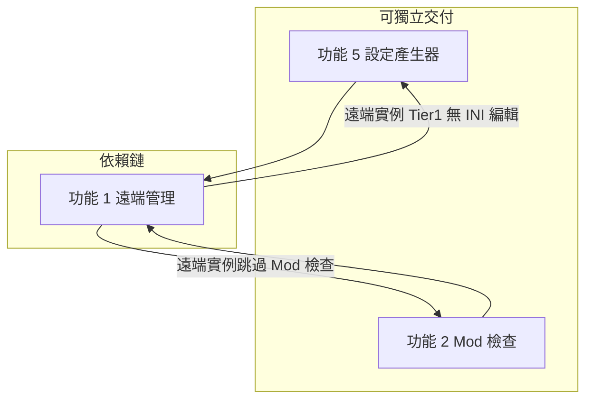

# P3 功能路線圖：遠端管理、Mod 相容檢查、設定產生器整合

> **狀態**：規劃中（未實作）  
> **最後更新**：2026-07-13  
> **基準版本**：v1.2.0（Palworld 1.0 對齊）  
> **適用讀者**：維護者、貢獻者、AI  coding agent

---

## 背景

v1.2.0 已完成 Palworld 1.0 的**本機 Windows 專服**核心對齊（設定、REST API、自動重啟、文件）。  
P3 聚焦三項**提升日常使用體驗**的功能，解決以下痛點：

| 痛點 | 對應功能 |
|------|----------|
| VPS / 遠端主機上的伺服器無法用 GUI 管理 | **功能 1：遠端伺服器管理** |
| 1.0 更新或 Mod 版本不符導致啟動失敗，難以事前排錯 | **功能 2：Mod 1.0 相容檢查** |
| 社群設定包難以套用；進階 INI 鍵 GUI 未涵蓋 | **功能 5：設定產生器整合** |

本文件定義各功能的**目標、範圍、技術方向、驗收條件**，作為未來 PR 的規格依據。

---

## 已知問題（Palworld 1.0）

v1.2.0 已對齊 1.0 核心開服流程，但下列三項**尚未修復**，可能在特定情境下影響開服或遊玩體驗。  
完整情境說明、暫時因應方式與開服／遊玩影響見 **[KNOWN_ISSUES.md](./KNOWN_ISSUES.md)**。

| # | 已知問題 | 嚴重度 | 什麼情況下會出問題（摘要） | 預計修復 |
|---|----------|--------|------------------------------|----------|
| 1 | **`WorldOption.sav` 同步已停用** | 高 | **已有存檔**的伺服器在 GUI 改世界設定（倍率、語音、跨平台等）後重啟，規則可能仍為舊值；**全新未進過遊戲的服**通常正常 | 功能 5 Phase D 或獨立 PR |
| 2 | **啟動前無 Mod／引擎相容檢查** | 高 | **EA 升 1.0 後未更新 UE4SS／Palguard**、**留有舊 Mod**、或新建服預設開 Mod 框架時，易**閃退／秒退**；純原版無 Mod 通常不受影響 | 功能 2 Phase A |
| 3 | **帕魯資料未更新至 1.0（187／287）** | 中 | **不影響開服與一般遊玩**；使用 GUI **贈送帕魯、圖鑑選單**時缺少約 100 隻 1.0 新帕魯 | 資料資產更新 PR |

**優先修復建議（與下文功能優先順序一致）：** #2 → #1 → #3（依「開服失敗」→「設定不生效」→「管理功能不完整」排序）。

---

## 功能 1：遠端伺服器管理（Remote Server Management）

### 1.1 功能代號

`P3-REMOTE` / `feature/remote-server-instance`

### 1.2 問題陳述

palserver-GUI 目前假設每個伺服器實例都在**本機 Windows** 上：

- 建立實例時會複製完整 `server/` 模板目錄（`createServerInstance.ts`）
- REST API、RCON 請求硬編碼 `127.0.0.1`（見 `sendRestAPI.ts`、`restAdmin.ts`、`sendRCONCommand.ts` 等）
- 啟動/停止、日誌、Mod、備份、Steam 更新等依賴本機檔案系統與 process

因此，在 **VPS、家用 NAS、朋友代管主機** 上已運行的 1.0 專服，無法透過 GUI 做日常維運。

### 1.3 功能目標（Goals）

1. **新增「遠端連線」類型的伺服器實例**，僅儲存連線 metadata，不複製 `server/` 目錄。
2. 使用者可在本機 GUI **監控與管理**已運行且 REST API 可達的遠端 1.0 專服。
3. Tier 1（最低交付）支援 REST 管理操作，與 v1.2.0 本機 REST 能力對齊。
4. 遠端與本機實例在首頁列表**共存**，UI 上可區分類型。

### 1.4 非目標（Non-Goals）

Tier 1 **不包含**（可列 Tier 2/3 或未來版本）：

- SSH / SFTP / RDP 連線實作
- 遠端一鍵安裝 SteamCMD 或更新遊戲引擎
- 遠端 Mod 管理、日誌讀取、備份瀏覽
- 遠端世界設定 INI 編輯（除非 Palworld 官方 REST 支援設定寫入）
- TLS / HTTPS 加密 REST（Palworld 官方 REST 為 HTTP Basic）
- 遠端啟動程序（spawn 遠端 `PalServer.exe`）

### 1.5 使用者故事與價值

| 故事 | 改善 |
|------|------|
| 我在 Hetzner VPS 架好 1.0 專服，想在家裡 PC 踢人、發公告 | 不必 RDP，GUI 直接 REST 管理 |
| 朋友架服，只給我 Admin 密碼，不想開整台遠端桌面 | 建立遠端連線即可協助維運 |
| 伺服器跑在家裡桌機，人在外需要緊急存檔關服 | 若 8212 埠可達，可遠端操作 |

### 1.6 現況（v1.2.0 已有）

| 項目 | 位置 | 說明 |
|------|------|------|
| 遠端建立 UI 骨架 | `src/renderer/components/Home/CreateRemoteServer/CreateRemoteServerAlert.tsx` | 收集 PublicIP/Port/AdminPassword；**建立邏輯未實作** |
| 首頁入口 | `src/renderer/pages/Home.tsx` | 「建立遠端連接」選項**已註解**（標註未完成） |
| REST 管理層 | `src/main/services/admin/restAdmin.ts`、`src/renderer/utils/restAdmin.ts` | kick/ban/announce/save/shutdown/info |
| REST IPC | `src/main/ipcs/server/rest/sendRestAPI.ts` | 固定 `127.0.0.1` |
| 本機建立流程 | `src/main/ipcs/server/instance/createServerInstance.ts` | 複製模板 + 寫 `.pal` + INI |
| 實例型別 | `src/types/ServerInstanceSetting.types.ts` | **無** `isRemote` 欄位 |

### 1.7 目標狀態（Target State）

#### Tier 1 — REST 遠端管理（建議 v1.3.0 最小交付）

**使用者流程：**

```
首頁 → 建立遠端連接
  → 填寫：顯示名稱、主機 IP/域名、REST 埠（預設 8212）、Admin 密碼
  → [可選] RCON 埠（預設 25575，供 Palguard 進階指令）
  → 連線測試（GET /v1/api/info）
  → 成功 → 寫入輕量實例 → 出現在伺服器列表
  → 進入管理：玩家列表、踢/封、廣播、存檔、關機、metrics、版本資訊
```

**資料模型擴充（`.pal` + 設定檔）：**

```typescript
// ServerInstanceSetting.types.ts 建議新增
export type ServerInstanceSetting = {
  // ...既有欄位
  readonly isRemote: boolean;           // 預設 false；本機實例向後相容
  readonly remoteHost?: string;         // IP 或域名
  readonly remoteRestPort?: number;     // 預設 8212
  readonly remoteRconPort?: number;     // 預設 25575
};
```

**遠端實例儲存結構（建議）：**

```
{USER_SERVER_INSTANCES_PATH}/{serverId}/
  .pal                          # ServerInstanceSetting（isRemote: true）
  remote-settings.json          # REST/RCON 連線與顯示用設定（替代 PalWorldSettings.ini）
```

**連線解析邏輯（核心 refactor）：**

新增 `getAdminHost(serverId)`：

- `isRemote === false` → `127.0.0.1`（維持現狀）
- `isRemote === true` → `remoteHost`（或 `remote-settings.json` 內 `PublicIP`）

需修改硬編碼 `127.0.0.1` 的檔案：

| 檔案 | 用途 |
|------|------|
| `src/main/ipcs/server/rest/sendRestAPI.ts` | REST IPC |
| `src/main/services/admin/restAdmin.ts` | REST 服務 |
| `src/main/ipcs/server/rcon/sendRCONCommand.ts` | RCON |
| `src/main/ipcs/server/exec/execShutdownServer.tsx` | 關機 RCON |
| `src/main/ipcs/server/exec/execStartServer.tsx` | 定時重啟 RCON（遠端實例應停用本機 spawn） |
| `src/main/server/server-online-map/server.ts` | 線上地圖 proxy（Tier 1 可對遠端禁用） |

**新 IPC（建議）：**

| Channel | 用途 |
|---------|------|
| `createRemoteServerInstance` | 建立 metadata-only 實例 |
| `testRemoteConnection` | 建立前驗證 REST 可達 |

**UI 功能開關（`isRemote === true` 時隱藏或禁用）：**

- 啟動 / 停止按鈕（`BootServerButton.tsx`）
- Steam 一鍵更新（`updateServerInstance`）
- Mod 管理、UE4SS/Palguard 切換
- 伺服器日誌、備份、資料夾大小
- 效能監控（pidusage）
- 世界設定 GUI 編輯（Tier 1；或唯讀顯示連線資訊）
- 線上地圖（需 proxy 改打遠端 host；Tier 1 可禁用）

**遠端仍可用（Tier 1）：**

- 玩家列表、踢人、封禁、解封
- 廣播（announce）
- 手動存檔（save）、關機（shutdown）
- 伺服器 info / metrics / 版本
- RCON Palguard 指令（若 RCON 埠對外可達且使用者知悉風險）

#### Tier 2 — 遠端設定與地圖（可選）

- 線上地圖 proxy 支援遠端 REST host
- 若官方提供設定 REST API，支援遠端讀寫世界參數

#### Tier 3 — 檔案級遠端（可選 / v2.0）

- SSH/SFTP 同步 INI、log、備份
- 或遠端 agent 服務

### 1.8 環境與安全前提（文件須告知使用者）

1. 遠端伺服器需已啟用 `RESTAPIEnabled=True`，且 `8212/TCP` 從 GUI 所在機器**可連線**（非僅 bind localhost）。
2. REST 使用 **HTTP 明文 + Basic Auth**；不應在不可信網路暴露 Admin 密碼。
3. 對外開 RCON（25575）有安全風險；Tier 1 可將 RCON 標為進階可選。
4. 防火牆 / NAT / 埠轉發需使用者自行設定。

### 1.9 驗收條件（Acceptance Criteria）— Tier 1

- [ ] 首頁可開啟「建立遠端連接」，填寫必要欄位後可建立實例
- [ ] 建立前連線測試失敗時有明確錯誤（埠不通、密碼錯、REST 未啟用）
- [ ] 遠端實例出現在列表，視覺上可與本機實例區分（badge / 圖示）
- [ ] 對遠端實例可：列出玩家、踢人、封禁、廣播、存檔、關機
- [ ] 對遠端實例不可：本機 spawn 啟動、Steam 更新、Mod 管理（按鈕隱藏或 disabled + tooltip 說明）
- [ ] 本機實例行為與 v1.2.0 **完全一致**（回歸測試）
- [ ] README / FAQ 新增遠端管理章節（埠、安全、限制）
- [ ] 五語系翻譯鍵補齊（`CreateRemoteServer` 等已存在，需補錯誤訊息與限制說明）

### 1.10 建議實作順序

1. 型別 + `remote-settings.json` 讀寫
2. `getAdminHost()` + REST/RCON 參數化
3. `createRemoteServerInstance` + `testRemoteConnection` IPC
4. 完成 `CreateRemoteServerAlert` + 啟用 Home 入口
5. 全域 `isRemote` 功能開關（各頁面）
6. 文件與 i18n

### 1.11 風險與依賴

| 風險 | 緩解 |
|------|------|
| 多處 `127.0.0.1` 漏改 | 集中 `getAdminHost()`，加整合測試 |
| 遠端 REST 只 bind localhost | 文件說明 + 連線測試錯誤指引 |
| 使用者期望遠端也能改設定 | Non-Goals 寫清楚；UI tooltip |

---

## 功能 2：Mod 1.0 相容檢查（Mod Compatibility Check）

### 2.1 功能代號

`P3-MOD-CHECK` / `feature/mod-compatibility-gate`

### 2.2 問題陳述

Palworld 升級至 1.0 後，**UE4SS、Palguard、遊戲引擎**版本不符是伺服器「按啟動後秒退或異常」的常見原因。

v1.2.0 現況：

- `ServerSettings.tsx` 可在設定頁比對 UE4SS/Palguard 版本並一鍵更新
- `EngineNeedInstall` 可在引擎過舊時提示 SteamCMD 更新
- **`BootServerButton` 啟動前不做任何 Mod/版本檢查**
- 無個別 Lua/pak Mod 的 1.0 相容性資料

使用者常在開服後或更新後才發現問題，除錯成本高。

### 2.3 功能目標（Goals）

1. 在**啟動伺服器前**（及可選：App 載入已選實例時）執行相容性檢查。
2. **Phase A（必做）**：檢查 UE4SS、Palguard、遊戲引擎版本是否與 GUI 內建模板 / 最新 1.0 相容。
3. 檢查失敗時提供**明確 UI**：說明哪個元件過舊、建議「一鍵更新」或「仍要啟動」。
4. 與現有 `updateUE4SS`、`updatePalguard`、`updateServerInstance` 流程整合，不重造輪子。

### 2.4 非目標（Non-Goals）

Phase A **不包含**：

- 每個 Lua Mod / pak Mod 的 1.0 相容性掃描（Phase B 可選）
- 自動下載社群 Mod 更新
- Linux Mod 路徑（`.so`）
- 遠端實例的 Mod 檢查（遠端無本機 `server/` 目錄）

Phase B（可選）：

- 維護 Mod 相容清單（JSON / 遠端 API）
- 掃描 `Mods/`、`Paks/` 目錄並比對

### 2.5 使用者故事與價值

| 故事 | 改善 |
|------|------|
| 1.0 更新後一按啟動就閃退 | 啟動前提示「Palguard 需更新」 |
| 週五開服前才發現 UE4SS 過舊 | 開服前 30 秒攔截或警告 |
| 新手照舊教學裝 Mod 不知道哪裡錯 | 指向具體元件與版本號 |

### 2.6 現況（v1.2.0 已有）

| 項目 | 位置 |
|------|------|
| 版本比較工具 | `src/renderer/utils/versionToValue.ts`（`isVersionOlder`） |
| UE4SS/Palguard 版本讀取 | `src/main/preload.ts`（`SERVER_*_VERSION`、`SYSTEM_*_VERSION`） |
| 設定頁升級 UI | `src/renderer/components/ServerManagement/ServerSettings/ServerSettings.tsx` |
| 引擎過舊提示 | `EngineNeedInstall.tsx`、`useRunServerInstall.ts` |
| 啟動入口 | `BootServerButton.tsx` → 直接 `execStartServer` |
| 模板更新 IPC | `updateUE4SS`、`updatePalguard`、`updateServerInstance` |

**已知缺口：**

- `ServerNeedUpgrade`（遊戲引擎）缺少 `hidden` 邏輯，可能一直顯示
- UE4SS 版本用 `Number()`，Palguard 用字串，格式不一致

### 2.7 目標狀態（Target State）

#### Phase A — 啟動前版本 Gate（建議 v1.2.x / v1.3.0）

**檢查時機：**

1. **主要**：使用者點「啟動伺服器」時（`BootServerButton.handleBootServer` 之前）
2. **可選**：選中本機實例且偵測到版本不符時，首頁或設定頁顯示 banner（類似 `EngineNeedInstall`）

**檢查項目：**

| 檢查項 | 資料來源 | 比對對象 | 嚴重度 |
|--------|----------|----------|--------|
| 遊戲引擎 | `useServerEngineVersion` / REST info | `useLatestGameVersion`（palservergui.net） | 高 |
| UE4SS | `SERVER_UE4SS_VERSION(serverId)` | `SYSTEM_UE4SS_VERSION()` | 高（若已啟用 ue4ss） |
| Palguard | `SERVER_PALGUARD_VERSION(serverId)` | `SYSTEM_PALGUARD_VERSION()` | 高（若已啟用 palguard） |

**UI 行為（AlertDialog 範例）：**

```
標題：啟動前相容性檢查
內容：
  - Palguard v0.4.x → 建議 v0.5.x（1.0）
  - [一鍵更新 Palguard] [一鍵更新引擎] [仍要啟動] [取消]
```

**規則建議：**

- `ue4ssEnabled === false` 時跳過 UE4SS 檢查
- `palguardEnabled === false` 時跳過 Palguard 檢查
- 「仍要啟動」需二次確認（checkbox「我了解風險」）
- 遠端實例（`isRemote`）跳過整段檢查

**建議新增：**

| 項目 | 說明 |
|------|------|
| IPC `checkModCompatibility` | main 程序讀版本檔，回傳 `{ ok, issues[] }` |
| `src/main/services/compatibility/checkCompatibility.ts` | 集中比對邏輯，供 IPC 與測試使用 |
| 單元測試 | mock 版本字串，覆蓋 `isVersionOlder` 邊界 |

#### Phase B — Mod 目錄掃描（可選，長期）

- 設定檔 `assets/mod-compatibility-1.0.json` 或從 `palservergui.net` 拉清單
- 掃描 `Pal/Binaries/Win64/Mods`、`Pal/Content/Paks`
- 列出「未知 / 已知不相容」Mod 名稱

### 2.8 驗收條件（Acceptance Criteria）— Phase A

- [ ] 本機實例啟動前執行相容性檢查
- [ ] UE4SS/Palguard/引擎任一過舊時顯示可理解的中文/英文說明（含版本號）
- [ ] 提供跳轉或觸發既有「一鍵更新」動作
- [ ] 使用者可選擇「仍要啟動」；本機預設不 silent bypass
- [ ] 已停用 UE4SS/Palguard 的項目不誤報
- [ ] 全部通過時不額外打斷，啟動流程與 v1.2.0 相同
- [ ] 修復 `ServerNeedUpgrade` 的 `hidden` 邏輯（若一併實作）
- [ ] 單元測試覆蓋比對邏輯

### 2.9 建議實作順序

1. 抽出 `checkCompatibility(serverId)` 純函式 + 測試
2. IPC `checkModCompatibility`
3. `BootServerButton` 整合 Alert 流程
4. 設定頁 banner（可選）
5. Phase B 評估（另開 issue）

### 2.10 風險與依賴

| 風險 | 緩解 |
|------|------|
| `*.version.txt` 僅存在 release assets | 文件註明；開發環境 mock |
| 過度攔截導致進階使用者反感 | 提供「仍要啟動」與設定「跳過檢查」（可選） |
| Phase B 清單維護成本 | 預設不做 Phase B，除非有社群維護機制 |

---

## 功能 5：設定產生器整合（Config Generator Integration）

### 5.1 功能代號

`P3-CONFIG-GEN` / `feature/world-settings-import-export`

### 5.2 問題陳述

世界設定是開服核心，但 v1.2.0 存在落差：

1. **GUI 未涵蓋所有 1.0 INI 鍵**（官方文件約 105–119 項；`settings.ts` 約 90+；部分鍵仅有 i18n 無控件）
2. **無法匯入** Discord / Wiki / 外部產生器的 `OptionSettings=(...)` 整段字串
3. **無法匯出** 便於分享或備份的設定片段
4. **JSON 編輯模式**已實作（`WorldSettingsJSONView.tsx`）但 UI 切換在 `WorldSettings.tsx` **被註解**
5. `palworld-worldoptions.exe`（INI ↔ `WorldOption.sav`）為 Windows 二進位，且 `setWorldSettingsiniByServerId` 內轉換邏輯**已註解**

使用者常被迫手改 `PalWorldSettings.ini`，易格式錯誤或漏項。

### 5.3 功能目標（Goals）

1. **匯入 / 匯出** `OptionSettings` 字串（複製貼上即可套用或分享）。
2. **重新啟用 JSON 檢視/編輯模式**，與 GUI 模式雙向同步。
3. **補齊高價值缺漏鍵**至 `settings.ts`（優先使用者常問、1.0 新增項）。
4. 匯入前**預覽 diff**（將變更哪些鍵），匯入後寫入既有 INI pipeline。
5. 文件說明與外部產生器（如 pal-conf 類工具）的**建議工作流程**（連結 + 匯入，非 iframe 嵌入）。

### 5.4 非目標（Non-Goals）

- 嵌入第三方網頁 iframe（CORS、維護、授權）
- 完全取代 `palworld-worldoptions.exe` 的 SAV 寫入（可列後續；需 SAV 格式研究）
- 自動從網路同步官方設定 schema（可列後續）
- 遠端實例的世界設定編輯（依功能 1 範圍）

### 5.5 使用者故事與價值

| 故事 | 改善 |
|------|------|
| Discord 有人貼 1.0「爽服」設定包 | 貼上 → 預覽 → 套用 |
| 開新服沿用舊服倍率規則 | 舊服匯出 → 新服匯入，只改名稱/埠 |
| 需要 `LogFormatType` 等 GUI 沒有的鍵 | 匯入或 JSON 模式直接改 |
| 分享設定給朋友 | 匯出一段文字即可 |

### 5.6 現況（v1.2.0 已有）

| 項目 | 位置 |
|------|------|
| INI ↔ JSON 解析 | `src/main/utils/palServerSettingConverter.js`（含 1.0 tuple 測試） |
| 讀寫 INI | `readWorldSettingsini.ts`、`writeWorldSettingsini.ts` |
| GUI 設定 catalog | `src/renderer/components/WorldSettings/settings.ts` |
| 世界設定頁 | `src/renderer/pages/WorldSettings.tsx` |
| JSON 檢視元件 | `WorldSettingsJSONView/WorldSettingsJSONView.tsx` |
| Windows SAV 工具 | `convertToWorldOptionsSav.ts`（多處已停用） |

**JSON 模式被關閉的位置：**

```63:77:src/renderer/pages/WorldSettings.tsx
          {/* <SegmentedControl.Root
            value={interfaceMode}
            onValueChange={(v: any) => {
              setInterfaceMode(v);
            }}
            ...
          </SegmentedControl.Root> */}
```

### 5.7 目標狀態（Target State）

#### Phase A — 匯入 / 匯出 + JSON 模式（建議 v1.2.x）

**UI 新增（世界設定頁 Actionbar 或頂部）：**

| 操作 | 行為 |
|------|------|
| **匯出 OptionSettings** | 將目前設定格式化為 `OptionSettings=(Key=Value,...)` 複製到剪貼簿 |
| **匯出 JSON** | 複製 pretty JSON |
| **匯入** | 開啟 Dialog：貼上 OptionSettings 或 JSON → 解析 → **預覽 diff** → 確認 → `setWorldSettings` |
| **GUI / JSON 切換** | 取消註解 SegmentedControl；切換時同步 state |

**匯入解析規則：**

- 接受完整 INI 行或純 `(Key=Value,...)` 括號內容
- 使用既有 `palServerSettingConverter.parse()`
- 未知鍵：**保留並寫入 INI**（forward compatible），GUI 未定义的键在 JSON 模式可見
- 解析失敗：顯示行號/片段，不寫入

**預覽 diff：**

- 列出將變更的鍵：舊值 → 新值
- 新增鍵、刪除鍵（若匯入不含某鍵是否覆蓋？**建議：合併 merge，非整包 replace** — 需在 UI 標明）

**IPC：**

- 可复用既有 `getWorldSettings` / `setWorldSettings`
- 可選新增 `parseWorldSettingsString` 在 main 程序解析（與 renderer 共用 converter）

#### Phase B — 補齊 GUI 缺漏鍵

對照 Palworld 1.0 官方 `PalWorldSettings.ini` 文件，優先加入：

| 優先級 | 示例鍵 | 說明 |
|--------|--------|------|
| 高 | `LogFormatType` | 日誌格式 Text/Json |
| 高 | `MaxBuildingLimitNum` | 建築上限 |
| 中 | `BuildObjectHpRate`、`EquipmentDurabilityDamageRate` | 建築/耐久 |
| 中 | `DenyTechnologyList` | 科技封鎖 |
| 低 | `bActiveUNKO`、`DropItemMaxNum_UNKO` | locale 已有但控件空 |

每新增一鍵需同步：`settings.ts`、`worldSettingsOptions`、五語系 `translation.js`、必要時 README。

#### Phase C — 外部產生器工作流（可選）

- README 新增「從外部產生器匯入」步驟
- 可選「開啟產生器網址」按鈕（`openLink`）
- 不嵌入 iframe

#### Phase D — SAV 轉換（可選 / 研究）

- 評估是否以 JS 重寫 `WorldOption.sav` 寫入，或恢復 `palworld-worldoptions.exe` 僅 Windows 可用路徑
- 文件註明：部分設定僅对新存档 via SAV 生效

### 5.8 驗收條件（Acceptance Criteria）— Phase A

- [ ] 世界設定頁可切換 GUI / JSON 模式，資料一致
- [ ] 可匯出 OptionSettings 字串至剪貼簿
- [ ] 可貼上 OptionSettings 或 JSON 匯入，失敗時有明確錯誤
- [ ] 匯入前顯示 diff 預覽，確認後才寫入 INI
- [ ] 匯入含 GUI 未定义键時仍可保存并在 JSON 模式顯示
- [ ] 現有 `palServerSettingConverter` 單元測試仍通過；新增匯入案例測試
- [ ] README 新增匯入/匯出說明

### 5.9 建議實作順序

1. 啟用 JSON SegmentedControl（最低風險）
2. Actionbar 匯出（copy OptionSettings / JSON）
3. 匯入 Dialog + parse + merge 策略
4. Diff 預覽 UI
5. Phase B 缺漏鍵分批 PR
6. 文件與 i18n

### 5.10 風險與依賴

| 風險 | 緩解 |
|------|------|
| 匯入 merge vs replace 行為混淆 | UI 明示；預設 merge |
| 未知鍵寫入後 GUI 不顯示 | JSON 模式 + 匯出可見 |
| 部分設定仅 SAV 生效 | 文件說明；Phase D 研究 |

---

## 跨功能依賴關係



- **功能 5** 與 **功能 2** 可並行開發，互不依賴。
- **功能 1** 完成後，需在 **功能 2** 明確跳過 `isRemote` 實例。
- **功能 5** 對遠端實例：Tier 1 不提供世界設定編輯；若未來 Tier 2 支援 REST 設定 API，再整合。

---

## 建議優先順序與版本

| 順序 | 功能 | 理由 | 建議版本 |
|------|------|------|----------|
| 1 | 功能 5 Phase A | 改動集中、風險低、全使用者受益 | v1.2.1 / v1.3.0 |
| 2 | 功能 2 Phase A | 減少 1.0 更新事故；复用現有版本邏輯 | v1.2.1 / v1.3.0 |
| 3 | 功能 1 Tier 1 | 價值高但 refactor 面較大 | v1.3.0 |
| 4 | 功能 5 Phase B | 持續補鍵，可 incremental | v1.3.x |
| 5 | 功能 2 Phase B | 需維護 Mod 清單 | 待定 |
| 6 | 功能 1 Tier 2+ | 視需求與官方 API | v1.4+ / v2.0 |

---

## 給 AI Agent 的實作檢查清單

開始 PR 前請確認：

1. 已閱讀對應功能的 **Goals / Non-Goals / Acceptance Criteria**
2. 本機實例行為不可 regression（尤其 REST 改 host 後）
3. 新增 UI 字串需更新 `locales/{zh_tw,zh_cn,en,jp,fr}/translation.js`
4. 解析/版本邏輯需加測試（`src/__tests__/`）
5. 完成後更新 `CHANGELOG.md` 對應版本區塊
6. 若實作 `isRemote`，所有假設本機 `server/` 路徑的程式需審查

---

## 修訂紀錄

| 日期 | 版本 | 說明 |
|------|------|------|
| 2026-07-13 | 1.0 | 初版：功能 1、2、5 規劃（v1.2.0 後 P3 範圍） |
| 2026-07-13 | 1.1 | 新增「已知問題」章節，連結 KNOWN_ISSUES.md |
